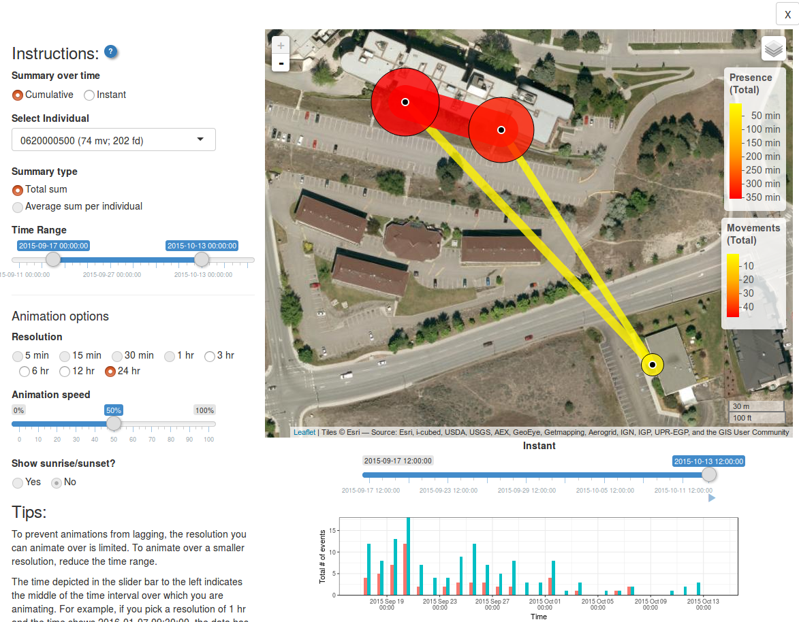

```{r setup, include = F}
source("setup.R")
```

Here we will go over visualizing your data with maps. `feedr` includes two wrapper functions that can be used to visualize your data on maps. These two functions, `map_leaflet` and `map_ggmap` are really just convenience functions to do a lot of the grunt work. If you want to achieve a more fine tuned map, I suggest you check out the packages `leaflet` and `ggmap`.

`map_leaflet` and `map_ggmap` take summarized presence and movement data and turn it into circles and paths around/between loggers representing time spent at different loggers and the amount of movement between particular logger paths. Because different projects may need different summaries (totals vs. means, corrected for number of individuals, uncorrected, etc.) we will first go over how to create the summary data and then pass this to the functions for plotting. This gives us more flexibility, but does mean that we have to do some work before we can visualize the data.

 `feedr` also includes a stand-alone shiny app (launched with `ui_animate()`) that can be used to create simple animations of your data, this is a simple process as it does not require summarized data, but is also less flexible (see [animations](#animations) below).

## Built-in Summaries

Let's start by calculating presence and movements:

```{r}
v <- visits(finches_lg)
p <- presence(v)
m <- move(v)
```

There are many ways we can summarize the data. The following options are available through the `summary` argument of the mapping functions:

- by individual
- totals (sums)
- totals corrected for number of individuals

<a id = "leaflet"></a>

## `map_leaflet()`

This function creates an interactive html map using leaflet for R (package `leaflet`). 

```{r}
map_leaflet(p = p, m = m, summary = "sum_indiv")
```

The map is interactive in that it can be zoomed, the tiles changed, and different elements added or removed. loggers (white-outlined black dots) can also be clicked on to reveal ids and circles and paths can clicked on to reveal their actual numbers.

You can also adjust some of the cosmetic details:

```{r}
map_leaflet(p = p, m = m, summary = "sum_indiv",
            p_scale = 0.5, m_scale = 0.5,
            p_title = "Presence (min)", m_title = "Paths (Total use)",
            p_pal = c("blue","white"), m_pal = c("black","red"))
```

To plot by individual, simply use individual summaries:

```{r}
map_leaflet(p = p, m = m, summary = "indiv")
```

Note, however, that for leaflet maps, the individual lines are stacked in order of magnitude and visualizations like this may not be very useful for large numbers of individuals.

To save this map, you can zoom and set it up as you like and use the "Export > Save as image" button in RStudio. 

Alternatively, you can use the `map_ggmap()` function to visualize a static map.

--------------------
Back to [top](#top) 
--------------------

<a id = "ggmap"></a>

## `map_ggmap()`

This creates static maps using the package `ggmap`. This map may take longer to create as it downloads background images from Google Maps (but you can also specify the source, see below).

```{r}
map_ggmap(p = p, m = m, summary = "sum_indiv")
```

Getting the zoom level often requires some trial and error (default = 17). If you see a warning about rows with missing values omitted, this means that not all your data could fit on the map, consider using a different zoom:

```{r}
map_ggmap(p = p, m = m, summary = "sum_indiv", zoom = 16)
```

```{r}
map_ggmap(p = p, m = m, summary = "sum_indiv",
          zoom = 16, p_scale = 0.7)
```

We can adjust the map type:

```{r}
map_ggmap(p = p, m = m, summary = "sum_indiv", maptype = "terrain")
```

```{r}
map_ggmap(p = p, m = m, summary = "sum_indiv", maptype = "roadmap")
```

For individuals:

```{r, error = TRUE}
map_ggmap(p = p, m = m, summary = "indiv")
```

Okay, let's try with fewer individuals

```{r, fig.width = 10, fig.height = 4}
map_ggmap(p = p, m = m, summary = "indiv",
          which = c("041868E9A8", "06200003AA"))
```

Let's look at all the birds for which we have movements

```{r, fig.width = 10, fig.height = 10}

ids <- unique(m$animal_id)

map_ggmap(p = p, m = m, summary = "indiv",
          which = ids)
```


## Custom Summaries

Calculate total time present at each logger, corrected for the number of individuals total

```{r}
p_pop <- p %>%
  group_by(logger_id) %>%
  summarize(amount = sum(length) / animal_n[1])
p_pop
```

We use `animal_n[1]` because we want to divide the total sum by the number of individuals in each experiment. However, the value `animal_n` is repeated, but we only need the first one, hence the `[1]`.

If we wanted to calculate mean time present, we would use `amount = mean(length)`  
If we wanted to calculate total time presence with no correction, we would use `amount = sum(length)`  

__Note:__ The new summary data set must have the column `amount`, regardless of how it is calculated. The mapping functions will look for that column name.

Now let's summarize the movement data for each movement path between loggers. We can summarize individually for each logger, which will account for the double counting (one row for leaving the logger and one row for arriving) as well as making sure we have `logger_id` in the final data set. We will also group by `lat` and `lon`, so they remain in the data set (because they are associated with `logger_id` they do not contribute any unique grouping combinations).


```{r}
m_pop <- m %>%
  group_by(logger_id, move_path, lat, lon) %>%
  summarize(path_use = length(move_path) / animal_n[1])
m_pop
```

__Note:__ The new summary data set must have the column `path_use`, regardless of how it is calculated. The mapping functions will look for that column name.

Specify `summary = none` when the data is already summarized:

```{r}
map_leaflet(p = p_pop, m = m_pop, summary = "none")
```

We can also summarize data by individual for plotting of individual maps.

This is virtually identical to what we did above, except that we add one more variable to group by and we don't correct for the number of individuals:

```{r}
p_indiv <- p %>%
  group_by(animal_id, logger_id) %>%
  summarize(amount = sum(length))
p_indiv

m_indiv <- m %>%
  group_by(animal_id, move_path, logger_id, lat, lon) %>%
  summarize(path_use = length(move_path))
m_indiv
```

### Recap:

To create maps you need to define a summary OR create custom summaries with the following:

- presence summary with a columns: `logger_id` and `amount`
- movement summary with a columns: `logger_id`, `move_path`, `path_use`, `lat`, and `lon`

If you want to look at individual data, add `animal_id` to the groupings.

## Animations

To look at animations of your data overtime, you can use the function `ui_animate()` to launch the animation shiny app included in the `feedr` package:

```{r, eval = FALSE}
ui_animate(v)
```



Here you can choose 

- Whether animations should show cumulative or instantaneous movements/path use
- Which individual (or all individuals) to animate over
- What kind of summary to show (total sum, or, if average sum, if all individuals are chosen)
- What time range
- The temporal resolution of each animated frame (i.e. the time frame that data will be summarized over)
- The animation speed (how fast will frames advance?)
- Whether to include a shadowed overlay showing sunrise and sunset

The figure along the bottom shows the number of movements and/or bouts of presence over time. This can help you chose which time frames to include.


--------------------------
Back to [top](#top)  
Go back to [home](index.html) | Go back to [transformations](transformations.html)
